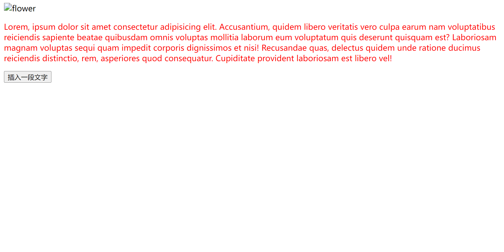
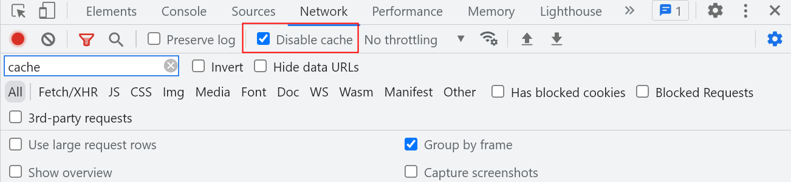
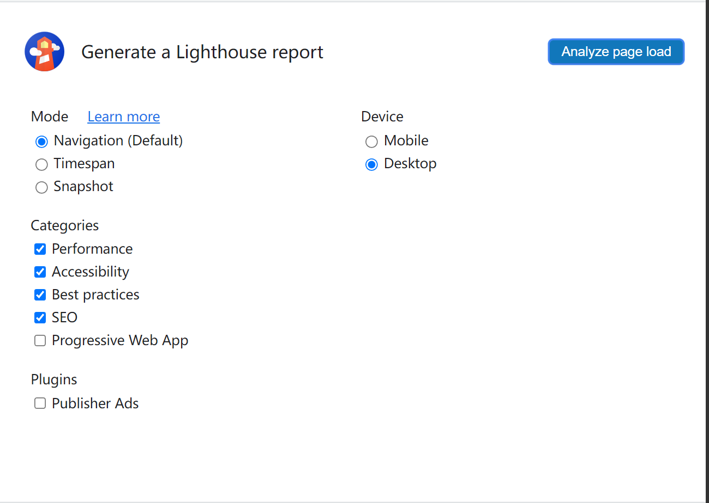
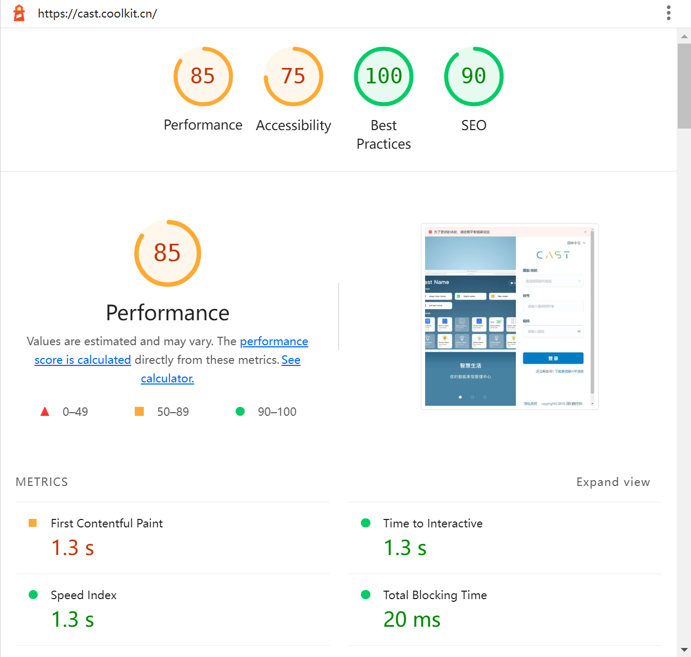
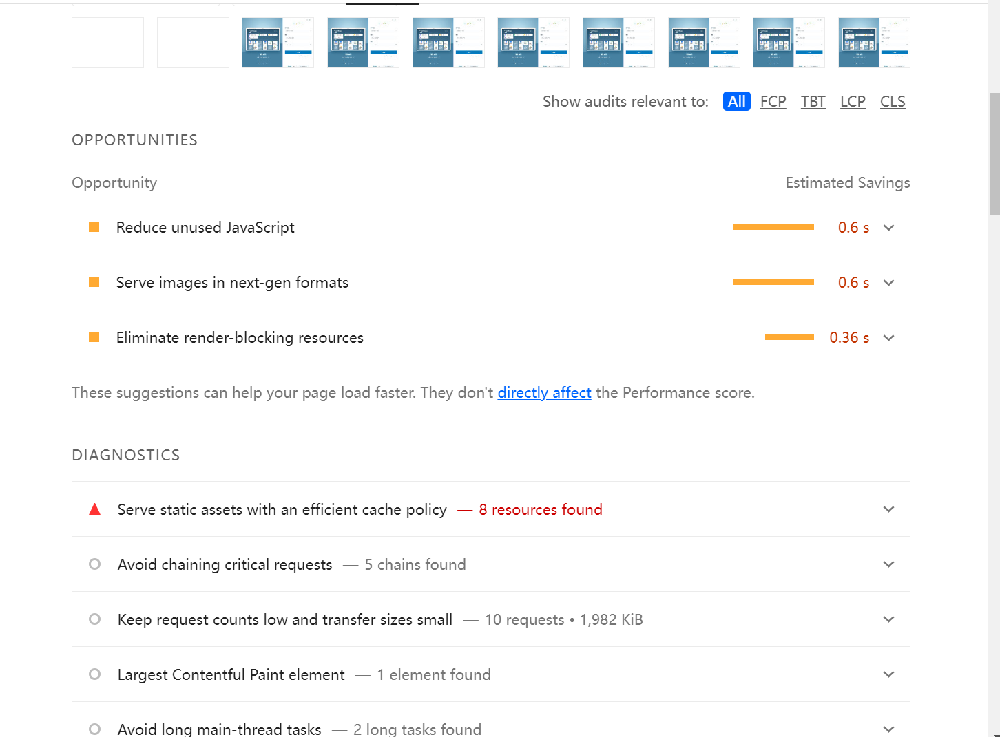
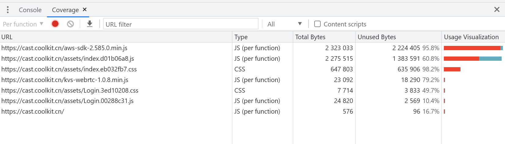

## Lighthouse
Chrome 开发者工具 Lighthouse 文档：https://developer.chrome.com/docs/lighthouse/   
如何提升网站加载速度：https://web.dev/fast/#prioritize-resources  
Accessibility 无障碍：https://web.dev/learn/accessibility/  
PageSpeed 在线测量工具：https://pagespeed.web.dev/  

----

### 一、使用方式
1. Chrome 开发者工具栏中 Lighthouse  
2. 作为 Node 模块加载 [参考](https://www.npmjs.com/package/lighthouse)
   - npm install -g lighthouse
   - lighthouse \<url\>：对指定的 url 执行测试
3. PageSpeed Web UI：https://pagespeed.web.dev/

### 二、性能指标
[前端性能优化经验分享](https://mp.weixin.qq.com/s?__biz=MzUxNzk1MjQ0Ng==&mid=2247512984&idx=2&sn=8090004de841dffebd3a677f935a26cf&chksm=f992b549cee53c5f2ecece880aff361712492f9ae199ab8e75e200e67cc30bd957f65404c3d4&mpshare=1&srcid=0208rMT6myqRQGyFY7A3MFzN&sharer_sharetime=1675823709885&sharer_shareid=a390b83a87c3f2ca862c45397e49f636&from=singlemessage&scene=1&subscene=10000&clicktime=1675844510&enterid=1675844510&sessionid=0&ascene=1&fasttmpl_type=0&fasttmpl_fullversion=6541338-zh_CN-zip&fasttmpl_flag=0&realreporttime=1675844510841&devicetype=android-33&version=28002055&nettype=WIFI&abtest_cookie=AAACAA%3D%3D&lang=zh_CN&exportkey=n_ChQIAhIQWRTwnt6X7Z0kIa4yFHaYERLlAQIE97dBBAEAAAAAAILZIVCUP8UAAAAOpnltbLcz9gKNyK89dVj0U%2FK%2BV0dxgNq6ujEGzlRs0jIPEjxBRFp%2BGlPE2Oew3e6oQxH4T0WG9WAvYvpUxMKvYvJ6YKV1zmUR9Xvi%2BWp3PvT62rxEppeoXKS10ZMO9md%2FKSbaQcgsw8VByymtoq4DqCnrpWhyx2I619GoC4N0uzE9zxVdyESEzovusVdQKi2Q9%2Fas7lu2XQ6g39e4DonJZGuOeK2fGUSnJIF1eMKfrDKI8YVBgWahyZvqMhP0Q5sRJMu%2BYFASCVEGV8sen88%3D&pass_ticket=38Vl3Pz%2FwNX%2F9Yt0sgdoUh6j0%2F1y8B3gdrrG6ZPAMPiL5qGejKn0vZWy2XfjwrRbBzIi477BaZGVys8r1ITmqg%3D%3D&wx_header=3)  
[Chrome Lighthouse 性能指标](https://developer.chrome.com/docs/lighthouse/performance/)

#### 指标评分标准
1. <font color=red>0 - 49</font>：显示红色，该指标表现很差
2. <font color=orange>50 - 89</font>：显示橙色，该指标当前状态较好，但还可以改善
3. <font color=green>90 - 100</font>：显示绿色，该指标状态优秀

#### 内容呈现相关
1. <font color=red>*</font> FCP ( First Contentful Paint )  
   **首次内容绘制**，首次绘制出页面元素（文本、图片、非空白的canvas、svg 等）的时间，可以用来衡量用户访问到显示出内容的白屏时间。

2. LCP ( Largest Contentful Paint )  
   **最大内容绘制**，用于记录**视窗内最大的元素绘制的时间**，该时间会随着页面渲染变化而变化，该时间会随着页面渲染变化而变化，因为页面中的最大元素在渲染过程中可能会发生改变，另外该指标会在用户第一次交互后停止记录。

3. SI ( Speed Index )
   **速度指数**，Lighthouse 会在页面加载的过程中录制视频，并通过计算视频中帧和帧之间的视觉变化的进度，这个指标反应了**网页内容填充的速度**。页面解析渲染的过程中，资源的加载和主线程执行的任务会影响到速度指数的结果。
   
4. <font color=red>*</font> CLS ( Cumulative Layout Shift )
   **累计布局位移偏离**，记录了页面上非预期的元素位移波动。CLS 的值越低说明页面跳来跳去的情况越少，用户体验越好。过大的 CLS 还会导致浏览器的回流，重新计算元素的位置，带来一定的性能问题。 
    - 例如页面上图片从未加载的状态到加载完成之后的状态，造成图片后的元素产生位移的情况    
        

        ----

        
    - 在文档中插入一段内容之后，造成之后的元素位移的情况。

#### 用户交互相关
1. TTI ( Time To Interactive )  
   介绍 TTI 之前，首先要介绍一下长任务，一个任务的执行耗时超过 50ms，这个任务就可以被认为是长任务，用户的交互操作也是在主线程执行的，所以当发生 Long Task 时，用户的交互操作很可能无法及时执行，这时用户就会体验到卡顿（当页面响应时间超过 100ms 时，用户可以体验到卡顿）。  
   **首次可交互的时间**，测量页面所有的资源加载成功并能够可靠快速的响应用户输入的时间，通常发生在页面依赖的资源已经加载完成，此时浏览器可以快速响应用户交互的时间。需要满足以下的几个条件
   - 从 FCP 指标后开始计算
   - 持续 5s 内无长任务，且无两个以上正在进行的 GET 请求。
   - 往前回溯至 5s 前的最后一个长任务结束的时间。

2. TBT ( Total Blocking Time )  
   **总阻塞时间**，记录在 FCP 到 TTI 之间所有长任务的阻塞时间总和。主线程执行的任务分为长任务和短任务。规定持续时间超过 50ms 的任务为长任务。低于 50ms 的任务为短任务。长任务超过 50ms 的时间被认为是“阻塞”的，因此，TBT 是所有长任务中阻塞时间的总和。TBT = FCP 和 TTI 之间发生的每个长任务的「阻塞时间」总和。例：  

     

   上图，有三个长任务，两个短任务。
  
     

   而 TBT 时长为 200+40+105=345ms。

3. <font color=red>*</font> FID ( First Input Delay )  
   **首次输入延迟**，记录在 FCP 和 TTI 之间用户首次与页面交互时响应的延迟。记录第一次与页面交互到浏览器真正能够处理响应该交互的时间，这个延迟出现的原因是浏览器的主线程可能在忙于其他工作，比如解析 JS 文件等，所以无法及时响应用户。

### 三、Chrome Lighthouse
Lighthouse 测试的结果，会受到 Chrome 插件、缓存等因数的影响。例如 Chrome 中安装了[油猴](https://chrome.google.com/webstore/detail/tampermonkey/dhdgffkkebhmkfjojejmpbldmpobfkfo?hl=zh-CN)，在网站打开时加载了一段脚本，这段脚本的加载和运行会影响到 Lighthouse 测试的结果。  

推荐的做法：
  - **打开一个无痕模式的窗口，且确保 NetWork 中 Disable cache 勾选之后再进行测试**  
      
  - **使用 [Pagespeed：https://pagespeed.web.dev/](https://pagespeed.web.dev/)**
  - **作为 Node 模块使用**

#### 界面可选项
1. Mode [参考](https://github.com/GoogleChrome/lighthouse/blob/HEAD/docs/user-flows.md)：测试模式
   - Navigation（默认）：分析单个页面加载情况
   - Timespan：分析任意一段时间内的页面运行情况，包括期间用户的操作
   - Snapshot：分析页面在当前时刻的状态

2. Device：设备模式
   - Mobile：移动端显示结果
   - Desktop：桌面端的显示结果

3. Categories：测试项目
   - Performance：各项性能指标
   - Accessibility：可访问性(无障碍)
   - SEO：seo情况
   - Best Practices [参考1：Chrome 文档](https://developer.chrome.com/docs/lighthouse/best-practices/) [参考2：最佳实践包含的方面](https://codegino.com/blog/lighthouse-best-practices)  
     最佳实践，指页面的代码符合各种规范，例如 HTML 有 docType 的声明，img 标签有 alt 属性。浏览器控制台没有打印错误和警告，避免使用存在风险的第三方 JavaScript 库，避免使用即将要弃用的API，....
   - Progressive Web App：渐进式 Web App 指标

4. Publisher Ads：Lighthouse 通过一系列自动审核提高广告速度和测量广告的整体质量。

### 执行测试，获取各项指标的结果和优化建议
1. 打开一个无痕窗口访问, https://cast.coolkit.cn/#/login （cast 登录页）,保证 NetWork 中的 Disable cache 选项勾选,

2. Lighthouse 配置如下
   

3. 测试结果受到本机当前网络好坏的影响，建议多测几次后取一个比较稳定的结果  
    
  


### 常用的优化方法
https://web.dev/fast/#prioritize-resources  
https://zhuanlan.zhihu.com/p/376925215

#### 关键指标的优化
1. LCP 首屏加载相关 [参考](https://web.dev/optimize-lcp/)
   - 使用 CDN 内容分发网络
   - 启用 Gzip 压缩
   - 使用合理的缓存机制，对 HTML、图片资源、将库文件提取为 vendor 后设置合理的缓存

   - 减少阻塞的 JS 和 CSS 文件大小
     + 压缩 JS 和 CSS
     + 查看代码的覆盖率，考虑将所有未使用的 CSS 完全删除或者拆分打包到其他的样式表中  
       
     + 延迟加载未使用的 JS 和 CSS
   - 优化图片资源
     + 超出首屏外的图片懒加载
     + 体积较小的图标考虑转化为 base64 格式或者使用 svg, 以减少网络请求
     + 使用合适格式的图片资源，JPG/JPEG 格式通常比 PNG 格式图片小
     + 在 Chrome 中支持使用 Webp 格式的图片，可以进一步的缩小图片的体积在移动端时提供一张小尺寸的图片,桌面端时提供一张大尺寸的图片
         ````html
         <!-- 使用 pictrue 标签提供多种图片资源，浏览器根据自身支持情况选择加载合适的图片 -->
         <picture>
            <!-- 在屏幕宽度为 768px 时, 使用小尺寸图片 -->
            <source srcset="small-img.png" media="(max-width: 768px)" />

            <!-- webp 格式 -->
            <source srcset="img.webp">

            <!-- 默认格式 -->
            
         </picture>
         ````
   - 预加载重要的资源  
      如果你知道某个特定资源应该被优先获取，请使用<link rel="preload">来更加及时地获取该资源。 多种类型的资源都可以进行预加载，但你应该首先侧重于预加载关键资产，例如字体、首屏图像或视频，以及关键路径 CSS 或 JavaScript。同时注意不能滥用 preload，过多预加载不必要的资源将会增加页面渲染的时间。
      ````html
      <link rel="preload" as="script" href="script.js" />
      <link rel="preload" as="style" href="style.css" />
      <link rel="preload" as="image" href="img.png" />
      <link rel="preload" as="video" href="vid.webm" type="video/webm" />
      <link rel="preload" href="font.woff2" as="font" type="font/woff2" crossorigin />
      ```` 

2. CLS [参考](https://web.dev/optimize-cls/)
   - img 标签带上 height 或者 width 属性, 或者通过包裹一个固定长宽的容器确保浏览器在加载图像期间可以正确分配空间的大小
     ````html
     

     <div style="height: 120px;">
        
     </div>
     ````
   - 为 ifame 或者其他元素的插入预留空间
   - 让用户决定是否加载某一部分的内容
   - 某些元素在做动画时不要对其他元素产生位移影响
   

3. FID [参考](https://web.dev/optimize-fid/)  
   糟糕的输入延迟大部分是由于 **执行繁重的 JavaScript 任务** 导致, 主要的优化方法还是优化 JavaScript 的加载, 避免 JavaScript 执行的时间过长导致用户在与页面交互时没法及时响应.

4. 代码方面的优化
   - 组件中手动绑定了事件, 要在组件销毁的时候手动解绑
   - 区分 v-show 和 v-if 的使用情况
   - 使用 v-for 时必须添加 key 属性
   - ...