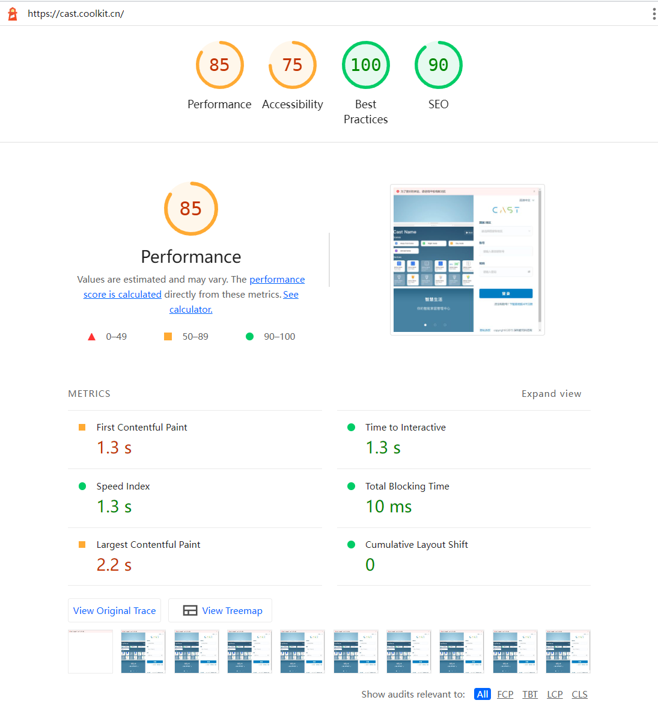
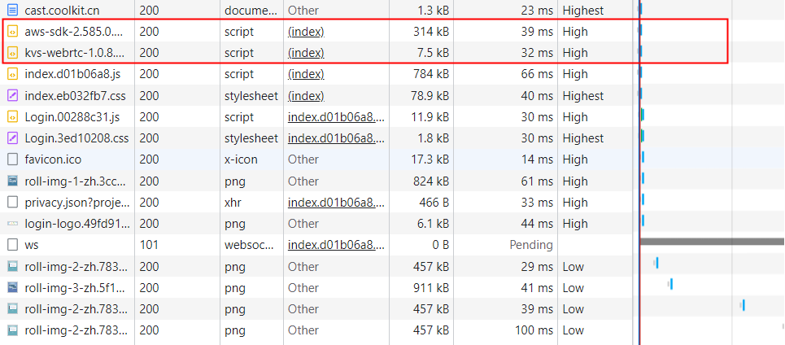
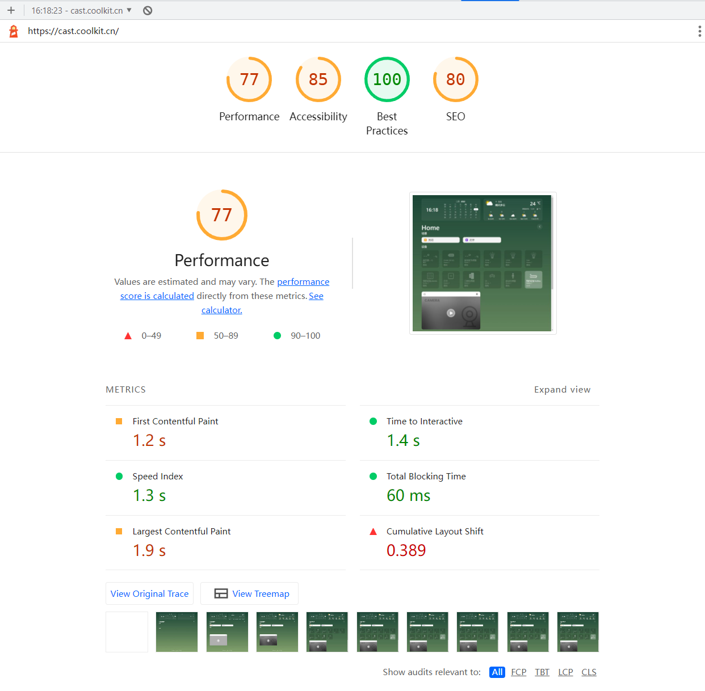

# Cast（桌面端）

## 登录页面

### 存在的问题
1. FCP 指标过大，在加载页面时白屏事件较长，为 1.3s。
2. LCP 指标过大，最大内容绘画项时间较长，主要的原因为轮播图中图片的大小接近 1M 。
   
### 优化
  1. 在 NetWork 中看到 Cast 页面在加载时，优先加载了 aws-sdk.js 和 kvs-webrtc.js 两个文件，且 aws-sdk.js 体积较大，在页面加载的过程中阻塞了 HTML 的解析，造成了页面白屏时间过长。且这两个文件不属于页面加载的关键请求，可以按需加载。
    

  2. 考虑将 aws-sdk.js 和 kvs.webrtc.js 还有打包中提取 vendor 并且设置合适的缓存

  3. 轮播图的图片接近 1M 的大小，加载时较为缓慢，可以压缩图片大小，采用 JPG / JPEG / Webp 格式的图片，同时注意在压缩的同时注意将画质损失控制在可接受的范围内。

  4. 图片可以设置合适的缓存

## Cast 详情页

### 存在的问题
1. FCP LCP 指标较大，其原因和登录页面一致
2. CLS 指标过大，原因是在加载设备磁贴、摄像头、图表的时候，存在摄像头组件或者图表组件先渲染，然后设备磁贴后渲染，导致摄像头或者图标组件向下位移，使得浏览器产生了回流。

### 优化
1. 详情页中小图标较多，将小图标转化为 Base64 格式减少请求
2. 规划页面中设备磁贴、摄像头、图表的加载过程，避免产生布局位移
