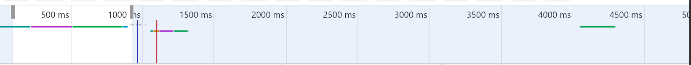
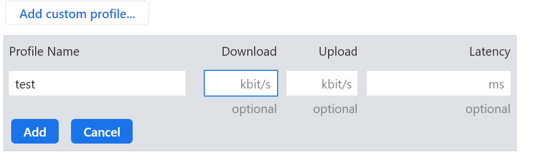
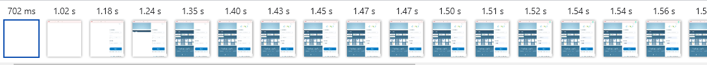
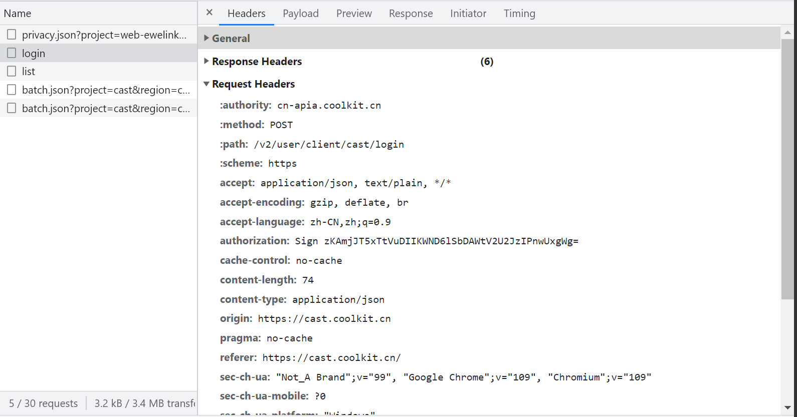

# Google Chrome 开发者工具

## 常用地址
- [Chrome 开发者工具官网](https://developer.chrome.com/docs/)
- [PageSpeed](https://pagespeed.web.dev/)
- [PageSpeed Insights 网站性能测试工具文档](https://developers.google.com/speed/docs/insights/v5/about?hl=zh-cn)

## 一、NetWork
### 选项卡
1.  监控网络请求按钮
   - 状态为红色时将监控每一个网络请求
   - 状态为灰色时不会监控网路请求

2.  清除按钮
  清除当前监控的网络请求记录

3.  过滤选项
   - 打开过滤选项 
      1. 关键词
      2. 正则表达式：/RegExp/
      3. 选项过滤（ctrl + 鼠标左键同时选中多个）
      4. 时间过滤
         

4. Preserve log  再刷新页面时，保留上一次请求的记录，可以用来对比上一次请求的结果和下一次请求的结果

5. Disable cache 禁用缓存

6. 模拟限速
   - No throttling：无限制
   - Fast 3G：较快的网络
   - Slow 3G: 较慢的网络
   - 自定义：
    

7.  导出/导入 HTTP 请求数据文件
   - 导出一个 har 文件，文件保存了当前所有网络请求的信息，har 文件格式基于 JSON
````json
{
    "log": {
        "version": "1.2",
        "creator": {
        "name": "WebInspector",
            "version": "537.36"
        },
        "pages": [
            {
                "startedDateTime": "2023-02-06T07:07:53.086Z", // 页面开始加载的时候
                "id": "page_9", // 页面唯一 id
                "title": "https://pagespeed.web.dev/", // 页面的 title
                "pageTimings": {
                    "onContentLoad": 1846.6320000588894, // 页面上所有的元素加载完成的时间
                    "onLoad": 2852.0880001597106 // 页面上开始加载到页面 onLoad 方法执行的时间
                }
            }
        ],
        "entries": [
            {
                "startedDateTime": "2015-09-06T10:02:41.645Z", // 请求发出的时间(ISO 8601)
                "time": 1221, // 该条请求花费的总的毫秒数
                "request": {
                    "method": "GET",
                    "url": "http://www.ihorve.com/", // 请求的url
                    "httpVersion": "HTTP/1.1", // http协议版本号
                    "cookies": [], // cookie对象列表
                    "headers": [ // header信息
                        {
                            "name": "Accept",
                            "value": "text/html,application/xhtml+xml"
                        }
                    ]
                },
                "response": {
                    "status": 200, // 状态码
                    "statusText": "OK",
                    "httpVersion": "HTTP/1.1",
                    "cookies": [], // cookie对象列表
                    "headers": [], // 响应头信息列表
                    "redirectURL": "", // 从响应头位置重定向目标URL
                    "headersSize": -1, // 从HTTP响应消息的开始，直到（且包括）的主体之前的双CRLF的总字节数，不可用设置为-1
                    "bodySize": 65047, // 响应体的字节数
                    "content": { // 响应体的详细信息
                        "size": 65047, // 响应体的字节数
                        "mimeType": "text/html; charset=UTF-8" // 响应体的mimeType
                    }
                },
                "cache": {}, // 缓存信息
                "timings": {
                    "blocked": 0, // 可选，等待网络连接的时间
                    "dns": -1, // 可选，dns解析时间，不可用设置为-1
                    "connect": -1, // 可选，创建TCP连接的时间，不可用设置为-1
                    "send": 0, // 发送HTTP请求到服务器的时间
                    "wait": 1126, // 等待响应的时间
                    "receive": 95, // 从服务器接收或从缓存读取的时间
                    "ssl": -1 // 可选，SSL/TLS协商需要的时间，不可用设置为-1
                }
            }
        ]
    }
}
````

8.  设置
   - Show overview：展示时间轴的预览
   - Capture screenshots：展示实时截图预览，可以预览到不同时间段内页面加载情况和网络请求的状况
   


### NetWork 主要内容
1. 参考资料
    - [Chrome Timing 名词介绍](https://developer.chrome.com/docs/devtools/network/reference/#timing-explanation)  
    - [CSDN 资料](https://blog.csdn.net/Arlingtonroad/article/details/109852319)

#### 请求表中的属性

   1. Name：资源名称和请求的路径
   2. Status: 状态码
   3. Type：请求的资源类型 script/stylesheet/png/xhr/...
   4. Size：响应头和响应体结合的大小，或者文件的大小
   5. Time：请求开始到接收到最后一个字节数据的时间
   6. Waterfall：瀑布流，可以观察请求在各个阶段中花费的时间，相当于请求详情中的 Timing
   7. Priority: 请求的优先级
   8. Initiator：请求是怎么发起的
      + Parser：在 html 解析时发起
      + Redirect：由页面的重定向发起
      + script：由 script 执行的过程中发起
      + other：请求由其他过程发起，比如页面的连接点击

#### 排序
1. 点击请求表中表头排序  
   

2. 根据请求中各阶段的时间来排序，在请求表头中，鼠标右键点击选中 **Waterfall** [Sort by activity phase 参考](https://developer.chrome.com/docs/devtools/network/reference/#sort-by-activity)
   - Start Time（**默认**）：根据请求开始的时间来排序
   - Response Time：根据请求初始化到响应的时间来排序
   - End Time：根据请求结束的时间来排序
   - Total Duration：根据请求的总时长来排序
   - Latency：根据等待响应的最短时间来排序

#### 请求的详细内容


1. Header
   - Response Headers：响应的请求头
   - Request Headers：请求的请求头

2. Payload：请求中的携带的参数信息
   - view source：切换为参数未格式化时的原始状态

3. Response：响应的 body 字符串信息

4. Preview：响应的 body 格式化后的信息

6. 

#### 请求瀑布流（Timing）
[Chrome Timing 名词介绍](https://developer.chrome.com/docs/devtools/network/reference/#timing-explanation)  

1. Queued at：表示请求加入到请求队列中的 **时刻**
2. Started at：表示请求开始处理的 **时刻**
3. Queueing：表示清除从加入请求队列中到请求开始处理经过的时间
4. Stalled：请求在可以被发送出去之前等待的时间（阻塞时间），一般是等待 TCP 连接建立完成到真正可以传输数据之间的时间差
5. Request sended：请求发送所需的时间
6. Waiting：从发出请求到到接收到响应的第一个字节所需的时间
7. Content Download：接收到完整的响应体（Response body）所花费的时间

#### 请求队列
1. 浏览器的并发机制  
   在浏览器刚刚流行的时候，大部分用户是通过拨号来上网，由于受当时的带宽条件的限制，无法使得用户的同时多个请求被处理。同时，当时的服务器的配置也比现在差很多，所以现在每个浏览器的连接数的大小也是有必要的。浏览器默认对同一域下的资源，只保持一定的连接数，阻塞过多的连接,以提高访问速度和解决阻塞问题。不同浏览器的默认值不一样，目前常用的 Chrome 版本的最大连接数量是 6。  
   | Browser | HTTP/1.1 | HTTP/1.0 |
   |---|---|---|
   | IE 6,7 | 2 |4 |
   | IE 8 | 6 | 6 |
   | Firefox 2 | 2 | 8 |
   | Firefox 3 | 6 | 6 |
   | Safari 3,4 | 4 | 4 |
   | Chrome 1,2 | 6| ? |
   | Chrome 3 | 4 | 4 |
   | Chrome 4+ | 6 | ? |
   | iPhone 2 |	4 |	? |
   | iPhone 3 | 6 | ? |
   | iPhone 4 | 4 | ? |
   | Opera 9.63,10.00alpha | 4 | 4
   | Opera 10.51+ | 8 | ? |

   数据来源：http://www.stevesouders.com/blog/2008/03/20/roundup-on-parallel-connections/  

2. 请求超时时间（Connection Timeout）  
   对于一般的 HTTP 请求来说，请求超时时间代表的是客户端最大的等待时间。超时时间是从请求被创建（不管该请求有没有进入请求队列中）开始计算，  
   也就是说，如果请求队列中的请求一直未能释放，那么后面的请求就无法进入请求队列中，导致经过了一定的时间后就超时取消了。

3. 请求的优先级 [请求之间的优先级](https://blog.csdn.net/hbiao68/article/details/119871598)  
   不同类型的请求优先级不一致，优先级较高的请求会先进入到请求队列中优先处理，优先级从低到高  
   同种资源的优先级还会受到
   依次为：Lowest、Low、Medium、High、Highest
   
   Chrome 中不同资源的优先级
   | 资源类型 | 优先级 |
   | --- |--- |
   | HTML | Highest |
   | CSS | Highest |
   | 通过 @import 加载的 Stylesheets | Highest，会被安排在阻塞脚本之后 |
   | Fonts | High |
   | 图片 | 默认是 Low，如果在视口窗口中渲染升级未 High|
   | JavaScript | Low / Medium / High，参考 https://addyosmani.com/blog/script-priorities/ |


4. 关键请求  
   关键请求就是显示在页面初始窗口时必要的请求资源。

5. 请求用来链  
   当浏览器在发出请求是由于另一个请求引用它时（也称为依赖项），我们称之为请求链。


### 从 NetWork 出发的优化点
1. 减少 HTTP 请求
   - 例如小图标转化为 Base64 或者使用 SVG
   - 图片懒加载
2. 压缩 CSS，JS，图片文件，减少资源的体积
3. 关键请求要加载
   - 最初的5个请求中应该为：HTML 文档 + 4个关键请求
   - 确保所有的关键请求不被重定向
   - 确保关键请求资源是优化过的，压缩过的，可以缓存的要尽量缓存
4. 避免过长的请求依赖链
5. 控制资源加载的顺序
   - 请求优先级会被 preload 的使用所影响。预加载的资源会被分配为高优先级，并且在页面的初始加载中优先被请求。(字体，css等，避免滥用)
````html
    <link rel="preload" href="Calibre-Regular.woff2" as="font" crossorigin />
````
   - 资源预读取，关键字 prefetch 作为元素 的属性 rel 的值，是为了提示浏览器，用户未来的浏览有可能需要加载目标资源，所以浏览器有可能通过事先获取和缓存对应资源，优化用户体验。浏览器会在空闲的时间去提前加载该资源。
````
<link rel="prefetch" href="https://i.snssdk.com/slardar/sdk.js" />
````
   - script 标签的引用配合 defer 和 async （[defer 和 async](https://blog.csdn.net/mrlmx/article/details/127581208)，[defer 和 async 对 script 标签优先级的影响](https://addyosmani.com/blog/script-priorities/)）
