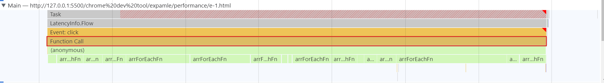

## Performance
Chrome 开发者工具 Performance 文档：https://developer.chrome.com/docs/devtools/performance/  
Performance 测量结果分析文档：https://developer.chrome.com/docs/devtools/performance/reference/  

用于测量页面 **运行时** 的性能表现，  

注意  
- 最好在无痕模式下打开浏览器页面进行测量，避免浏览器插件或者其他因数的干扰

### 测量结果界面 [参考1](https://developer.chrome.com/docs/devtools/performance/reference/) [参考2](https://www.jianshu.com/p/2a84e858565c)

- 时间刻度轴  
   + FPS：帧率（每秒帧数）。绿色竖线越高，FPS 越高。 FPS 图表上的红色块表示长时间帧，很可能会出现卡顿
   + CPU：CPU 资源。此面积图指示消耗 CPU 资源的事件类型。CPU 与下方的 Summary 是一致的，这部分的颜色也是一一对应。占比越大的部分意味着消耗CPU资源也越多
   + NET：每条彩色横杠表示一种资源。横杠越长，检索资源所需的时间越长。 每个横杠的浅色部分表示等待时间（从请求资源到第一个字节下载完成的时间）

- Frames，对应时间下对应的页面显示情况

- Interactions，对应时间轴下发生的用户和浏览器页面的交互情况

- Experience：体验，会指出当前出现不利于用户体验的地方。

- Main，代表主线程，也是我们需要重点关注的部分，这一部分的图像官方称为flame chart (火焰图)
  + x轴的一段横条代表执行一个事件(函数)，长度越长，花费的时间越多；
  + y轴代表调用栈，如果几个事件(函数)在y轴上堆叠在一起，这意味着上方的事件(函数)调用了下方的事件(函数)。如果在这些横条中右上角是红色的就表示在该段代码执行过程中可能存在性能问题.

- Summary：显示当前选中部分的运行总览，包括总运行用时，函数的调用情况等。
    + Self Time：Self Time represents the time directly spent in that activity，Self Time 是自身活动执行的时间
    + Total Time：Total Time represents the time spent in that activity or any of its children. Total Time 是自身和其子活动执行的总共用时。

- Bottom-Up 事件时长排序
  
- Call Tree 表示浏览器基本操作(事件执行,绘制...)的事件调用顺序和占用时间

- Event Log 事件发生的先后顺序及占用时间

### 分析主线程中任务队列的执行情况，找出性能的瓶颈
1. 通过鼠标点击或者滚轮选择一个时间段，查看 Main 主线程上的任务执行情况
   

2. 在 Interactions 中可以查看用户的点击  
   可以看到这部分的任务执行情况是由于用户鼠标移入（pointerup）和用户点击（click）所引起的。  
   

3. 分析主线程中，执行了那些任务以及任务执行的情况和耗时。
     
   - Task：代表了当前的执行的任务，如果任务的执行时间超过了 50ms 则该任务为长任务，红色的部分为超过 50ms 的时间部分
   - Event:click：代表了当前的执行的时间类型
   - Function call：表示函数的调用，Function call 的再下一层为调用的函数。再往下为函数调用的堆栈。

5. 点击任务，可以查看任务的总览，调用树等。可以在 Summary 中定位到具体的代码
   

6. 根据执行的总耗时，分析代码的执行时间过长是由什么引起的。
